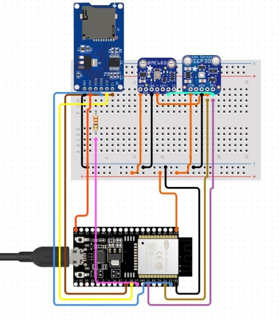

# environmental-data-storage
esp32 logger supported by micropython with sgp30, bme680, and sd card reader

### Libraries in this project:
* [Adafruit bme680](https://github.com/adafruit/Adafruit_CircuitPython_BME680)

### Wiring diagram

